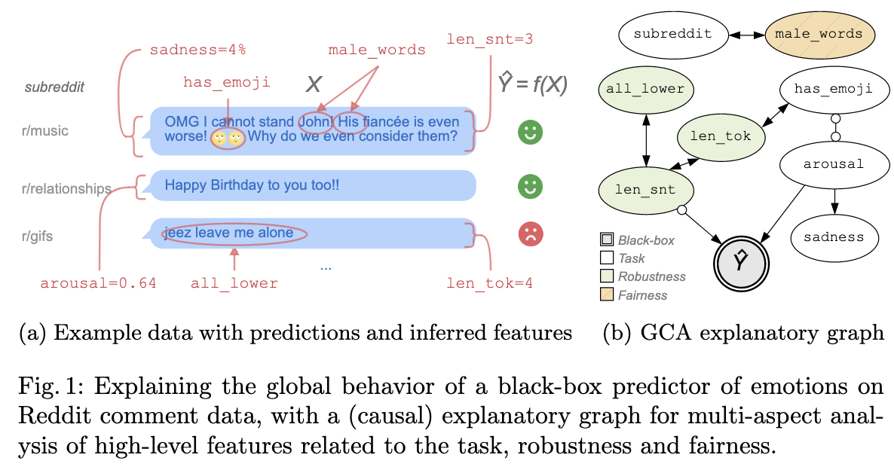

# Global Causal Analysis
This project contains a Python package `gca` and Jupyter Notebook to apply Global Causal Analysis (GCA) to the GoEmotions dataset. It corresponds to the paper "_Explaining Model Behavior with Global Causal Analysis_", accepted at _The 1st World Conference on Explainable Artificial Intelligence_ (xAI 2023).



## Citation
If you use the `gca` software, please cite our conference paper:

```bibtex
@inproceedings{Robeer2023,
    author={Robeer, Marcel and Bex, Floris and Feelders, Ad and Prakken, Henry},
    title={{Explaining Model Behavior with Global Causal Analysis}},
    booktitle={Proceedings of the 1st World Conference on Explainable Artificial Intelligence},
    year={2023},
}
```

## Installation
Clone this package and install it locally with `pip3 install .`.

The requirements should be installed automatically. If not, an overview of the requirements is included in `requirements.txt`.

## Experiments
The experiments are included in `GlobalCausalAnalysis.ipynb`. 

Model finetuning (3 epochs) takes approximately 1.5 hours on a single Tesla T4 GPU (Google Colab). Therefore, in the `/data` folder we have included a `.csv` file containing all features for the `test` split of GoEmotions: $X$ (`text`), $Z_{task}$, $Z_{robust}$, $Z_{fair}$, $\hat{Y}$ (`PRED_label`).

In the Notebook, we set the class-wise one-versus-rest contrast, and convert $\hat{Y}$ (`PRED_label`) into $\hat{Y}_{positive}$ (`PRED_positive`), $\hat{Y}_{negative}$ (`PRED_negative`), $\hat{Y}_{ambiguous}$ (`PRED_ambiguous`) and $\hat{Y}_{neutral}$ (`PRED_neutral`).

## Troubleshooting
> FileNotFoundError: [Errno 2] "dot" not found in path.

Install [`graphviz`](https://graphviz.org/download/) on your system.

> None of PyTorch, TensorFlow >= 2.0, or Flax have been found. Models won't be available and only tokenizers, configuration and file/data utilities can be used.

Install PyTorch, TensorFlow >= 2.0 or Flax to use `transformers` (only required when training or applying the black-box model).

> Cannot set maximum depth of FCI

As of 0.1.3.3, the maximum depth of FCI could not be set. Use `pip3 install git+https://github.com/py-why/causal-learn.git@f4c37718a218e8dc8f44fb1ed44a3f4c891a4bab`, or a later version of `causal-learn` if it becomes available in the meantime.
